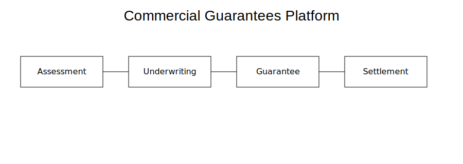
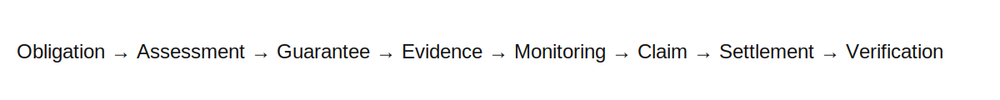

# Commercial Guarantees


cat > /tmp/readme-nav.md <<'EOF'
## Documentation

| Start Here | Products | Examples |
|------------|----------|----------|
| [Problem](docs/PROBLEM.md) | [Software Delivery](products/software-delivery-guarantee.md) | [Software Agency](examples/software-agency.md) |
| [How It Works](docs/HOW_IT_WORKS.md) | [Milestone Completion](products/milestone-completion-guarantee.md) | [Manufacturing](examples/manufacturing.md) |
| [Architecture](docs/ARCHITECTURE.md) | [Advance Payment](products/advance-payment-guarantee.md) | [Construction](examples/construction.md) |

- 📖 [Full Documentation](docs/README.md)
- 🗺️ [Roadmap](docs/ROADMAP.md)
- ❓ [FAQ](docs/FAQ.md)

---
EOF

Evidence-first commercial guarantees for modern commercial transactions.

---

## Platform Overview



---

## Why Commercial Guarantees?

Commercial guarantees reduce trust friction between buyers and suppliers by
providing structured assessment, underwriting, monitoring, trigger evaluation,
claim handling, settlement, and verification.

---

## Guarantee Lifecycle



---

## Products

- Software Delivery Guarantee
- Milestone Completion Guarantee
- Advance Payment Guarantee

See:

- `products/software-delivery-guarantee.md`
- `products/milestone-completion-guarantee.md`
- `products/advance-payment-guarantee.md`

---

## Documentation

- docs/PROBLEM.md
- docs/HOW_IT_WORKS.md
- docs/ARCHITECTURE.md
- docs/FAQ.md
- docs/ROADMAP.md

---

## Examples

- Software Agency
- Manufacturing
- Construction

---

## Repository Structure

```text
docs/
products/
examples/
images/                                                                                                             Status

This repository documents the public product architecture.

Implementation continues in a separate engineering repository.

License

MIT
