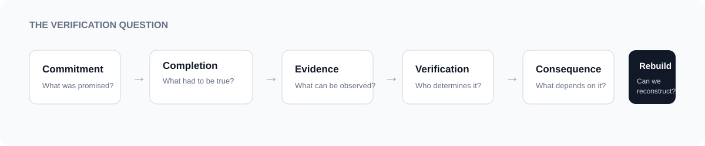

# Can You Prove It?

> **Research into consequential commercial commitments: what was promised, what counts as complete, what evidence proves it, and what happens when the answer matters.**

**Syzygy Dynamics** is investigating infrastructure for bounded commercial commitments. This repository is the public research surface; implementation work continues separately.

## Start here

| If you want to... | Read |
|---|---|
| **Audit one real commitment** | [Can You Prove It? — Private Commitment Audit](docs/research/can-you-prove-it.md) |
| Understand the central question | [Problem](docs/PROBLEM.md) |
| **Run a Recon investigation consistently** | [Recon Operator Protocol](docs/research/recon-operator-protocol.md) |
| See the method on a concrete example | [Commitment Teardown](docs/research/commitment-teardown.md) |
| Explore the current implementation wedge | [Enterprise Software Implementation](examples/enterprise-software-implementation.md) |
| See the current research questions | [Research Topics](docs/research/README.md) |
| Understand what is and is not validated | [Commercial Validation](docs/VALIDATION.md) |
| See current status | [Validation Status](docs/status/VALIDATION_STATUS.md) |

---

## The question

A contract can say:

> **“Production deployment will be completed by October 31.”**

The difficult question often comes later:

> **What observable evidence would allow both sides to establish that the commitment was actually satisfied?**

A consequential commitment becomes easier to reason about when its factual boundary is explicit:

**Commitment → Completion condition → Evidence → Verification → Consequence → Reconstruction**

### See the method

This is not a proposal to eliminate commercial judgment. It is a research question about whether the factual basis for a consequential decision can be made sufficiently clear that different parties can reach the same conclusion from the available evidence.

---

## Current research surface

The first commercial research wedge is **enterprise software production deployment**.

We are looking at situations where a milestone may involve:

- production deployment
- acceptance testing
- production verification
- milestone payment
- disputed completion
- evidence scattered across operational records

The current research topics are deliberately narrow:

- **[ERP Implementation Acceptance](docs/research/erp-implementation-acceptance.md)** — what actually defines “complete”?
- **[Go-Live Acceptance](docs/research/go-live-acceptance.md)** — what evidence establishes that a go-live milestone was satisfied?
- **[Milestone Payment Disputes](docs/research/milestone-payment-disputes.md)** — what happens when payment depends on a disputed completion?
- **[Can You Prove It?](docs/research/can-you-prove-it.md)** — can one real commitment survive the audit?
- **[Commitment Teardown](docs/research/commitment-teardown.md)** — a worked example of the method.

[Explore the research topics →](docs/research/README.md)

---

## Bring a real case

The strongest evidence is not another hypothetical discussion.

It is a real commitment.

If you have:

- a disputed milestone from a completed project;
- an important commitment currently being executed; or
- an upcoming milestone whose completion needs to be unambiguous,

you can submit a **redacted** commitment for a private manual audit.

We look at:

1. what was promised;
2. what had to be true for it to count as complete;
3. what evidence establishes those conditions;
4. who or what verifies the evidence;
5. what commercial consequence depends on the determination; and
6. whether the determination could later be reconstructed.

[Submit a redacted commitment →](docs/research/can-you-prove-it.md)

**Do not publish confidential commitment text in a public GitHub discussion.**

---

## Current reference case

**Enterprise software production deployment**

- **Milestone:** production deployment completed
- **Deadline:** 31 October 2026, 18:00 UTC
- **Acceptance:** all mandatory tests pass
- **Evidence:** deployment record + production verification + test results
- **Trigger:** milestone cannot be demonstrated against agreed conditions
- **Maximum reference guarantee response:** ₹1,00,000

This is a **reference product definition**, not a live customer guarantee.

The guarantee deliberately does not cover complete project success, general customer satisfaction, every post-go-live defect, business outcomes, or unlimited damages.

[Read the complete reference case →](examples/enterprise-software-implementation.md)

---

## What is actually validated?

**Not much commercially yet—and that is intentional.**

Technical validation and commercial validation are separate.

Current sequence:

**Problem → Frequency → Commercial consequence → Evidence → Buyer → Value → Price → Pilot**

Current status:

| Signal | Status |
|---|---|
| Technical reference lifecycle | Demonstrated |
| Public product definition | Documented |
| Practitioner research | In progress |
| Real customer commitment | None yet |
| Paid pilot | None |
| Guarantee issued | None |
| Pricing validated | No |

The project will not treat more documentation or more engineering as a substitute for market evidence.

[Read the current validation boundary →](docs/VALIDATION.md)

---

## What we do not claim

- No commercial guarantees have been issued.
- No paid pilot has been secured.
- Pricing has not been validated.
- Product-market fit has not been established.
- The reference case is not evidence that customers will adopt the mechanism.

This repository is a research and validation surface, not a claim of existing market adoption.

---

## Collaboration

This is intentionally lightweight.

Useful contributions are not more abstractions. They are **real observations**:

- a disputed milestone;
- a redacted acceptance condition;
- evidence that settled a disagreement;
- a case where evidence failed to settle it;
- a failure mode we have not considered.

If you have a real case, start with the [research topics](docs/research/README.md) or contact us privately through the [Can You Prove It? audit](docs/research/can-you-prove-it.md).

---

## Repository boundary

The public repository documents the commercial model, practitioner research, examples, product boundaries, and validation status.

Implementation continues in separate engineering repositories.

> **Build evidence before expansion.**

The useful question remains:

> **What real-world claim would this allow a customer to make more safely?**

---

## License

MIT
