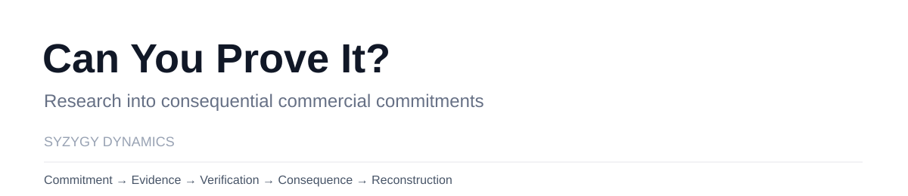

# Can You Prove It?

> **Research into consequential commercial commitments: what was promised, what counts as complete, what evidence establishes it, and what economic consequence follows.**

**Syzygy Dynamics** investigates how commercial commitments move from **obligation → evidence → recognition → economic consequence**.

The repository is the public research surface. Implementation work continues separately.

## Start here

| Company direction | [Canonical Company State](docs/COMPANY_STATE.md) |
|---|---|
| Recon evolution | [Recon v0.2](docs/research/recon-v0-2.md) |
| How we visualize company progress | [Company State Visuals](docs/COMPANY_STATE_VISUALS.md) |

| If you want to... | Read |
|---|---|
| **Audit one real commitment** | [Can You Prove It? — Commercial Commitment Audit](docs/research/can-you-prove-it.md) |
| Understand the problem | [Problem](docs/PROBLEM.md) |
| See the method on a concrete example | [Commitment Teardown](docs/research/commitment-teardown.md) |
| Explore the implementation wedge | [Enterprise Software Implementation](examples/enterprise-software-implementation.md) |
| See current research | [Research Topics](docs/research/README.md) |
| See what is and is not validated | [Commercial Validation](docs/VALIDATION.md) |

---

## The problem

Commercial milestones often connect work to an economic consequence:

**delivery → acceptance → payment / handover / release / other obligation**

The difficulty is not always knowing what was supposed to happen. It is establishing **what actually happened from evidence that the relevant parties can inspect and recognize**.

Evidence may be distributed across contracts, project records, test results, acceptance certificates, correspondence, operational systems, invoices, and payment records.

When those records do not line up, the economic state becomes difficult to determine.

So we investigate:

> **When a consequential commercial commitment changes the economic state of a transaction, can the parties reconstruct the condition, evidence, recognition boundary, and consequence clearly enough to act?**

This is a research question, not a claim that the problem has already been solved.

## The method

For one real commercial situation, we reconstruct:

**Commitment → Completion condition → Evidence → Recognition → Economic consequence**

Then we preserve:

- what is established;
- what is uncertain or conflicting;
- what evidence is missing;
- who or what has authority to recognize the condition;
- what economic state should follow;
- whether the determination can later be reconstructed.

The method is manual today. Software comes later only if repeated work creates measurable value.

## Current research surface

The first commercial research wedge is **enterprise software implementation and acceptance**.

We are studying situations involving:

- implementation milestones;
- UAT and acceptance;
- production deployment and go-live;
- payment triggers;
- disputed completion;
- distributed evidence;
- dependencies that delay recognition or payment.

The wedge is an investigation surface, **not the definition of the whole company**.

## Bring a real case

The strongest evidence is not another hypothetical discussion.

It is a real commitment.

If you have:

- a disputed milestone;
- an important commitment currently being executed; or
- an upcoming milestone whose completion needs to be unambiguous,

you can request a **private manual Commercial Commitment Audit**.

Do not publish confidential commitment text in a public GitHub discussion.

[Request a pilot audit →](docs/research/can-you-prove-it.md)

## What we visualize

We track company change through two things:

### 1. Economic reality

What money, obligation, entitlement, or exposure is actually moving?

We do **not** turn third-party transaction values into company revenue, TAM, or “success.” A documented project value is evidence about the economic environment, not our revenue.

### 2. Evidence of company progress

What have we actually established?

**Observed problem → real situation → customer conversation → paid work → measurable outcome → repetition**

This prevents GitHub activity, documentation volume, or architecture from being mistaken for commercial progress.

[See the current visual state →](docs/COMPANY_STATE_VISUALS.md)

## Current validation boundary

**The problem is increasingly evidenced. The commercial mechanism is not yet proven.**

| Signal | Status |
|---|---|
| Recurring commercial mechanism observed | **Yes — research evidence** |
| Real-world implementation/acceptance cases reconstructed | **Yes** |
| Public commercial audit surface | **Live** |
| First live customer conversation | **In progress** |
| Paid pilot | **Not yet established** |
| Pricing validated | **No** |
| Guarantee issued | **No** |
| Repeatable acquisition | **No** |
| Product-market fit | **No** |

The project will not treat more documentation or engineering as a substitute for market evidence.

## What we do not claim

- We have not established product-market fit.
- We have not validated pricing.
- We have not issued a commercial guarantee.
- Third-party project values are not Syzygy revenue.
- A reconstructed dispute does not prove that a customer would have bought our mechanism before the dispute.
- A technically demonstrated lifecycle is not evidence of market demand.

The useful question remains:

> **What real-world economic transition would this allow a customer to make more safely, more quickly, or with less unresolved exposure?**

## Repository boundary

The public repository documents the problem, research, commercial validation, examples, and current company state.

Implementation continues in separate engineering repositories.

> **Build evidence before expansion.**

---

## License

MIT
